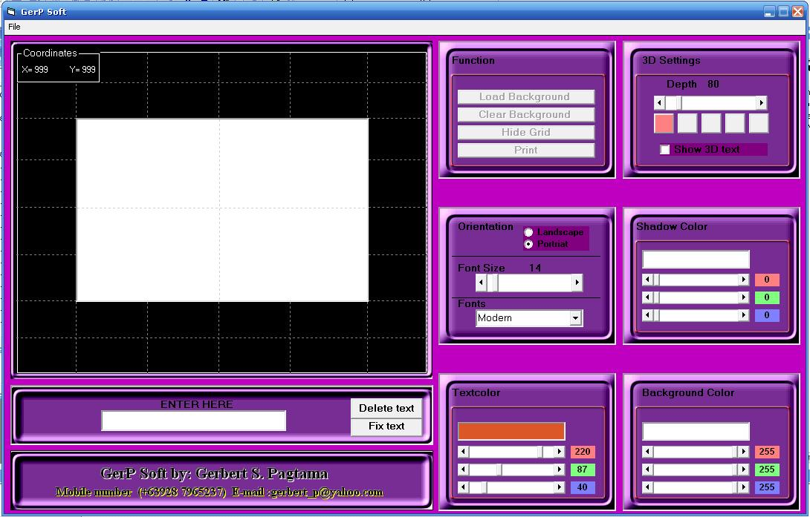



## ID CARD MAKER

### Description

GerP soft - is a graphical program, it use for designing a customize ID CARD MAKER,

by choosing font, colors ,bacground, shadows and any kinds graphic picture and it capable to print,&#8230;
 
### More Info
 

             |
---                |---
**Submitted On**   |2007-06-16 21:44:28
**By**             |[Gerbert Pagtama](https://github.com/Planet-Source-Code/PSCIndex/blob/master/ByAuthor/gerbert-pagtama.md)
**Level**          |Intermediate
**User Rating**    |4.3 (152 globes from 35 users)
**Compatibility**  |VB 3\.0, VB 4\.0 \(16\-bit\), VB 4\.0 \(32\-bit\), VB 5\.0, VB 6\.0
**Category**       |[Coding Standards](https://github.com/Planet-Source-Code/PSCIndex/blob/master/ByCategory/coding-standards__1-43.md)
**World**          |[Visual Basic](https://github.com/Planet-Source-Code/PSCIndex/blob/master/ByWorld/visual-basic.md)
**Archive File**   |[ID\_CARD\_MA2071256162007\.zip](https://github.com/Planet-Source-Code/gerbert-pagtama-id-card-maker__1-68721/archive/master.zip)

